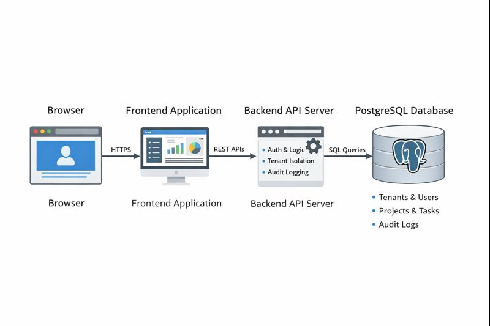
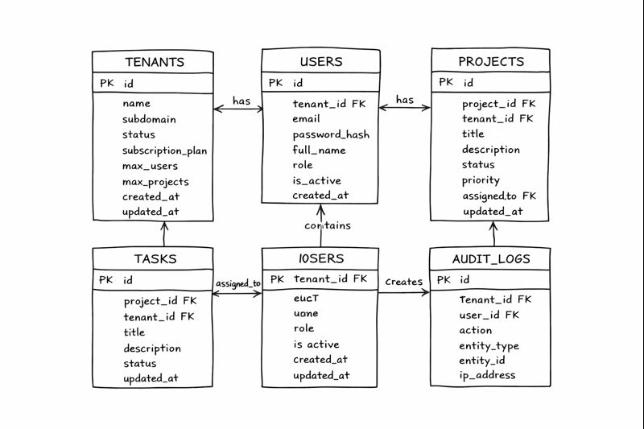

# System Architecture Document

## Multi-Tenant SaaS Platform – Project & Task Management System

---

## 1. Overview

This document describes the system architecture of the Multi-Tenant SaaS Platform. The application is designed using a client-server architecture with a clear separation between the frontend, backend API, and database. The system supports multiple tenants while ensuring complete data isolation, role-based access control, and secure communication between components.

---

## 2. High-Level System Architecture

### 2.1 Architecture Description

The system follows a three-tier architecture:

1. **Client (Browser)**  
   Users access the application through a web browser. All user interactions happen via the frontend application.

2. **Frontend Application**  
   The frontend is a single-page application responsible for:

   - Rendering UI screens
   - Handling user input
   - Managing authentication state
   - Communicating with the backend API

3. **Backend API Server**  
   The backend exposes RESTful APIs that handle:

   - Authentication and authorization
   - Business logic
   - Tenant data isolation
   - Database operations
   - Audit logging

4. **Database (PostgreSQL)**  
   The database stores all persistent data including tenants, users, projects, tasks, and audit logs.

All components are containerized using Docker and orchestrated using Docker Compose.

---

### 2.2 System Architecture Diagram

The following diagram illustrates the high-level architecture of the system:

- Browser → Frontend Application
- Frontend Application → Backend API
- Backend API → PostgreSQL Database
- JWT-based authentication flow between frontend and backend

📌 **Diagram :**

## 3. Authentication and Authorization Flow

1. A user accesses the frontend via the browser.
2. The frontend sends login credentials to the backend API.
3. The backend validates credentials and generates a JWT token.
4. The JWT token contains userId, tenantId, and role.
5. The frontend stores the JWT token and includes it in all subsequent API requests.
6. Backend middleware validates the JWT and enforces role-based access control.

This flow ensures stateless and secure authentication.

---

## 4. Database Architecture

### 4.1 Database Design Overview

The application uses a shared database with a shared schema approach. All tenant-specific tables include a `tenant_id` column to ensure data isolation. Super admin users are an exception and have `tenant_id` set to NULL.

Foreign key constraints and indexes are used to maintain data integrity and improve query performance.

---

### 4.2 Entity Relationship Diagram (ERD)

The database consists of the following core tables:

- tenants
- users
- projects
- tasks
- audit_logs

Relationships:

- One tenant can have many users.
- One tenant can have many projects.
- One project can have many tasks.
- Users can be assigned tasks.
- All actions are logged in audit_logs.

📌 **ERD Diagram:**

---

## 5. Multi-Tenancy and Data Isolation Strategy

- Every request is authenticated using JWT.
- The tenant_id is extracted from the JWT token.
- Backend queries automatically filter data using tenant_id.
- Client-provided tenant_id values are never trusted.
- Super admin users can access data across tenants, but do not belong to any tenant.

This strategy ensures complete data isolation between tenants.

---

## 6. API Architecture

### 6.1 API Modules

The backend API is organized into the following modules:

- Authentication
- Tenant Management
- User Management
- Project Management
- Task Management

Each module has its own controllers, routes, and middleware.

---

### 6.2 API Endpoint List

#### Authentication APIs

- POST /api/auth/register-tenant (Public)
- POST /api/auth/login (Public)
- GET /api/auth/me (Authenticated)
- POST /api/auth/logout (Authenticated)

#### Tenant Management APIs

- GET /api/tenants/:tenantId (Authenticated)
- PUT /api/tenants/:tenantId (Tenant Admin / Super Admin)
- GET /api/tenants (Super Admin)

#### User Management APIs

- POST /api/tenants/:tenantId/users (Tenant Admin)
- GET /api/tenants/:tenantId/users (Authenticated)
- PUT /api/users/:userId (Authenticated)
- DELETE /api/users/:userId (Tenant Admin)

#### Project Management APIs

- POST /api/projects (Authenticated)
- GET /api/projects (Authenticated)
- PUT /api/projects/:projectId (Authorized Users)
- DELETE /api/projects/:projectId (Authorized Users)

#### Task Management APIs

- POST /api/projects/:projectId/tasks (Authenticated)
- GET /api/projects/:projectId/tasks (Authenticated)
- PATCH /api/tasks/:taskId/status (Authenticated)
- PUT /api/tasks/:taskId (Authenticated)

---

## 7. Deployment Architecture (Docker-Based)

The application is deployed using Docker Compose with three services:

- **database** – PostgreSQL database service
- **backend** – Backend API service
- **frontend** – Frontend web application

All services communicate over a Docker network using service names instead of localhost. The system is started using a single command:

- docker-compose up -d

---

## 8. Summary

The system architecture ensures:

- Clear separation of concerns
- Secure and scalable multi-tenancy
- Role-based access control
- Dockerized deployment for consistency and ease of evaluation

This architecture supports future scalability while maintaining simplicity and security.
